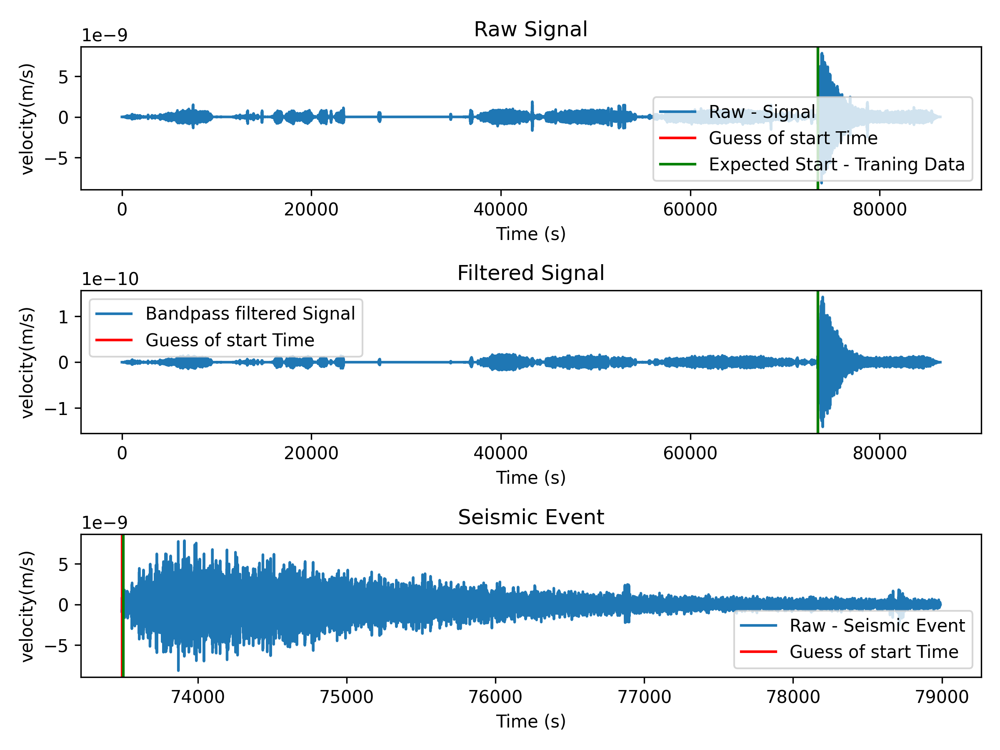

# 2024_NASA_Apps



## Setup

Follow these steps to set up your Python development environment:

### 1. Create a Python Virtual Environment

It is recommended to use a virtual environment to manage your project's dependencies and avoid conflicts with system-wide packages.

```bash
# Navigate to your project directory
cd /path/to/your/project

# Create a virtual environment
python -m venv venv

# Activate the virtual environment
# On Windows:
venv\Scripts\activate
# On macOS/Linux:
source venv/bin/activate
```

### 2. Install Dependencies

Once the virtual environment is activated, you can install all the required packages using `pip`:

```bash
# Install required packages from requirements.txt
pip install -r requirements.txt
```

This will install all the necessary dependencies listed in the `requirements.txt` file.

### 3. Deactivate the Virtual Environment (Optional)

When you're done working, you can deactivate the virtual environment by running:

```bash
deactivate
```

### 4. Re-Activate the Virtual Environment (When Needed)

Each time you start working on the project, remember to activate the virtual environment:

```bash
# On Windows:
venv\Scripts\activate
# On macOS/Linux:
source venv/bin/activate
```
---
## Running the Streamlit App

Follow the instructions below to run the Streamlit app in your local environment:

### 1. Activate the Python Virtual Environment

Before running the app, ensure that your virtual environment is activated.

```bash
# On Windows:
venv\Scripts\activate

# On macOS/Linux:
source venv/bin/activate
```

### 2. Install Dependencies

If you haven’t installed the required dependencies yet, do so by running:

```bash
pip install -r requirements.txt
```

This will ensure all necessary packages, including Streamlit, are installed.

### 3. Run the Streamlit App

Once your virtual environment is activated and dependencies are installed, you can run the Streamlit app using the following command:

```bash
streamlit run Streamlit.py
```

### 4. Open the Streamlit App in Your Browser

After running the command, Streamlit will automatically open your app in the default web browser. If it doesn't, you can manually open the app by visiting the following URL:

```
http://localhost:8501
```

### 5. Stop the Streamlit App

To stop the Streamlit app, press `Ctrl + C` in the terminal where the app is running.
